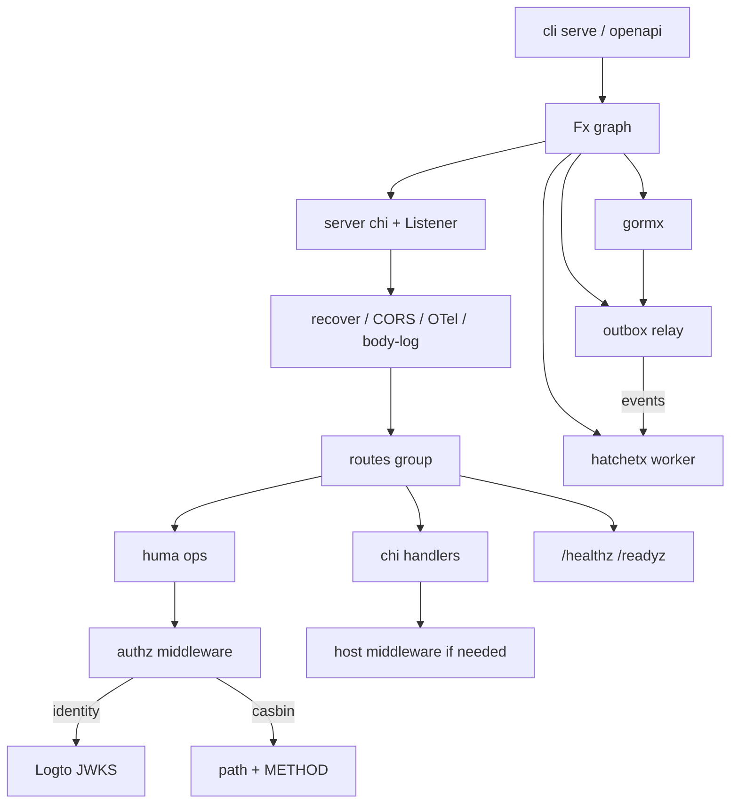

# fxkit 使用文档

`fxkit` 是一套基于 **Uber Fx** 的 Go 微服务脚手架：用可组合的 Module 把 HTTP、配置、观测、鉴权、GORM、Hatchet（workflow / cron / events / actor）与事务性 Outbox 装进同一个进程。

> **当前定位**：默认栈**不再依赖 Dapr**。HTTP 由 `server.ListenerModule` 直接监听；异步与定时能力走 **Hatchet**；跨事务发布走 **outbox**。

> **Agent Skills**：可复制到其他项目的 Cursor/Claude skills 见 [`skills/`](./skills/README.md)（覆盖全部主要子包：核心 / Huma+crudx / Hatchet+outbox / authz / otel / consul+reqx / docs）。

---

## 目录

1. [快速开始](#1-快速开始)
2. [模块包一览](#2-模块包一览)
3. [Bundle：Default / Minimal / 自定义](#3-bundledefault--minimal--自定义)
4. [配置参考](#4-配置参考)
5. [HTTP：chi / 路由 / 健康检查](#5-httpchi--路由--健康检查)
6. [Huma REST](#6-huma-rest)
7. [鉴权 authz（JWT + Casbin）](#7-鉴权-authzjwt--casbin)
8. [数据库 gormx](#8-数据库-gormx)
9. [列表查询 crudx](#9-列表查询-crudx)
10. [统一错误 fxerrors](#10-统一错误-fxerrors)
11. [事务性 Outbox](#11-事务性-outbox)
12. [Hatchet：事件 / 工作流 / Cron / Actor](#12-hatchet事件--工作流--cron--actor)
13. [可观测性 otelx](#13-可观测性-otelx)
14. [API 文档 docs / openapi](#14-api-文档-docs--openapi)
15. [服务发现 consulx / reqx](#15-服务发现-consulx)
16. [脚手架 CLI](#16-脚手架-cli)
17. [脚手架示例](#17-脚手架示例)
18. [安全与运维清单](#18-安全与运维清单)
19. [架构示意](#19-架构示意)

---

## 1. 快速开始

### 安装 CLI

```bash
go install github.com/fitan/fxkit/cmd/fxkit@latest
fxkit init myplatform --module github.com/me/myplatform
cd myplatform
fxkit new hello
make run SVC=hello
```

本地开发（指向本仓库）：

```bash
git clone https://github.com/fitan/fxkit.git
cd fxkit
go build -o ~/bin/fxkit ./cmd/fxkit
fxkit init myplatform --module github.com/me/myplatform --fxkit-path "$(pwd)"
cd myplatform && fxkit new hello && make run SVC=hello
```

### 最小 main

```go
package main

import (
	"github.com/fitan/fxkit"
	"github.com/fitan/fxkit/cli"

	"myapp/internal/hello"
)

func main() {
	cli.SetRootName("myapp", "myapp service")
	fxkit.Run(fxkit.Default(), hello.Module)
}
```

启动：

```bash
./myapp serve --config configs/config.yaml
# 多服务改端口：
./myapp serve --port 8081
# 离线导出 OpenAPI（不监听 HTTP；默认 3.0 YAML）：
./myapp openapi > openapi.yaml
```

内置探针：

| 路径 | 含义 |
|------|------|
| `GET /healthz` | 存活 |
| `GET /readyz` | 就绪（配置了 DB 时会 ping） |
| `GET /version` | 构建信息 |
| `GET /docs` | Scalar API 文档（若挂载 docs） |

---

## 2. 模块包一览

| 包 | 作用 |
|----|------|
| `fxkit` | `Default` / `Minimal` / `Run` / `Service` |
| `fxkit/config` | YAML + flag + 可选 Consul KV；`Load`/`Provide` 解各包 `Config` |
| `fxkit/cli` | Cobra：`serve` / `openapi` / `version` |
| `fxkit/server` | chi mux、中间件、HTTP Server、健康检查 |
| `fxkit/huma` | Huma v2 REST + `ListQueryInput`；可选 `RegisterResource` |
| `fxkit/server` | chi mux、中间件、HTTP Server、健康检查 |
| `fxkit/huma` | Huma v2 REST + `ListQueryInput`；可选 `RegisterResource` |
| `fxkit/authz` | JWT/X-User 认人 + Casbin path/method RBAC（**仅 Huma**） |
| `fxkit/gormx` | `*Client`：`Conn(ctx)` / `Transaction` |
| `fxkit/crudx` | ZStack 风格 list / cursor / `GetByID` |
| `fxkit/outbox` | 事务性 outbox + relay + inbox 去重 |
| `fxkit/hatchetx` | Hatchet client/worker、Actor、Reminder、Cron 归一化 |
| `fxkit/otelx` | OTel traces / metrics / logs + slog |
| `fxkit/fxerrors` | 统一错误（Problem Details 风格） |
| `fxkit/docs` | Scalar + OpenAPI；可选 base YAML + Huma 合并 |
| `fxkit/openapi` | 合并静态 OpenAPI YAML 与 Huma live spec |
| `fxkit/consulx` | Consul 自注册（TTL）+ 元数据补丁 |
| `fxkit/reqx` | 基于 `imroc/req` 的出站 HTTP（Consul healthy watch + failover + otel） |
| `fxkit/buildinfo` | `-ldflags` 构建元数据 |
| `fxkit/logx` | 彩色控制台 slog |
| `fxkit/cmd/fxkit` | `fxkit init` / `fxkit new` / `fxkit gen resource` / `fxkit gen client` |

---

## 3. Bundle：Default / Minimal / 自定义

```go
// 常用全家桶（含 HTTP listener）
fxkit.Default()

// 仅 config + buildinfo + server + docs + cli
fxkit.Minimal()

// 自选
fx.Options(config.Module, server.Module, server.ListenerModule, gormx.Module, ...)
```

`Default()` 当前包含：

`config` · `buildinfo` · `otelx` · `server` · **`server.ListenerModule`** · `docs` · `gormx` · `hatchetx` · `outbox` · `authz` · `consulx` · `reqx` · `cli`

业务侧通常再加：

```go
fxkit.Run(
	fxkit.Default(),
	huma.Module,          // 需要 Huma REST 时必加
	myapp.Module,
)
```

声明业务模块：

```go
var Module = fxkit.Service("hello", NewService,
	fxkit.Routes(newRoutes),
	fxkit.Provide(NewSomething),
	fxkit.Invoke(seedOnStart),
)
```

---

## 4. 配置参考

优先级（高 → 低）：

1. CLI：`--port`
2. Consul KV YAML（`--consul` + `--consul-key`；覆盖本地同名键）
3. 本地 YAML（`--config`；与 Consul 同时存在时先读本地；**仅 Consul** 时本地文件缺失可跳过）
4. 各配置类型的 `SetDefaults`（`config.Load` / `Provide` 时）

配置树**不**从 `FXKIT_*` 环境变量覆盖。定位配置源只用 CLI。Consul ACL 仍读 `CONSUL_HTTP_TOKEN`。

从 Consul 启动示例：

```bash
# 将完整 config.yaml 写入 Consul KV 后：
consul kv put config/myapp.yaml @configs/config.yaml

./myapp serve \
  --consul localhost:8500 \
  --consul-key config/myapp.yaml
```

`--consul` 只负责**拉配置**，不会回填 `discovery.consul_address`。服务注册/发现请在 YAML 里写 `discovery.*`。

### 完整示例

```yaml
server:
  port: "8080"
  log_payloads: false          # true 时记录请求/响应体（含脱敏启发式）
  cors_allowed_origins:        # 空列表 = 不设 CORS；显式 ["*"] 才允许任意源
    - "http://localhost:3000"

app:
  name: "myapp"

db:
  driver: "sqlite"             # mysql | postgres | sqlite；空 = 不连库
  dsn: "file:./.data/app.db?cache=shared"
  log_level: "warn"            # silent | error | warn | info
  max_idle_conns: 10
  max_open_conns: 100
  conn_max_lifetime: 1h

outbox:
  enabled: false
  poll_interval: 1s            # 必须 > 0，非法值启动失败
  batch_size: 50
  max_retries: 10
  claim_timeout: 30s           # processing 租约超时后可被其他 relay 回收

hatchet:
  enabled: false
  token: ""                    # 或 HATCHET_CLIENT_TOKEN
  host_port: "localhost:7077"  # host:port；loopback 默认 TLS strategy=none
  namespace: ""
  worker_name: "fxkit-worker"
  outbox_publisher: true       # outbox relay 推 Hatchet events
  otel: true                   # worker hatchet.start_step_run；复用 otelx TracerProvider

auth:
  enabled: false
  issuer: "http://localhost:3001/oidc"
  audience: "https://api.example.com"
  jwks_url: ""                 # 默认 {issuer}/jwks
  org_claim: "organization_id"
  require_org: false
  deny_unregistered: false     # Casbin 关闭时：true = 未登记 403；false = 登录即可
  dev_header_user: false       # true 允许 X-User 绕过 JWT（仅本地）
  tls_insecure: false          # 跳过 JWKS 证书校验（仅本地自签 IdP）
  casbin:
    enabled: false
    table_name: "casbin_rule"
    auto_register_routes: true
    bootstrap_role: "admin"
    bootstrap_users: []
    auto_bind_bootstrap: false
    reload_interval: 5s        # 多副本从 DB 重载策略；0s 关闭

otel:
  enabled: false
  service_name: "myapp"
  service_version: "0.1.0"
  environment: "development"
  endpoint: "localhost:4317"   # 可写 https://host:4317，会自动去掉 scheme
  protocol: "grpc"             # grpc | http
  insecure: true
  sampling: "always_on"
  traces:
    enabled: true
    exporter: "otlp"           # otlp | stdout
  metrics:
    enabled: true
    exporter: "otlp"
    runtime_metrics: true
  logs:
    enabled: true
    exporter: "otlp"

discovery:
  consul_address: ""           # 空 = 跳过
  consul_passing_only: true    # reqx 是否只取 healthy
  register: false              # true = 以 app.name TTL 自注册
  advertise_address: ""        # 空 = 自动本机 IP
```

### 扩展业务配置

不要把业务键塞进框架包。YAML 增加自己的顶层段，用 `ProvideConfig` 注入；非法值在 `Load`/`Provide` 时失败，进程退出，不会悄悄回退：

```yaml
orders:
  page_size: 20
  feature:
    enabled: true
    key: "abc"
```

```go
type OrdersConfig struct {
	PageSize int `yaml:"page_size"`
	Feature  struct {
		Enabled bool   `yaml:"enabled"`
		Key     string `yaml:"key"`
	} `yaml:"feature"`
}

var Module = fxkit.Service("orders", NewService,
	fxkit.ProvideConfig[OrdersConfig]("orders"),
)

func NewService(cfg *OrdersConfig, db *gormx.Client) *Service {
	return &Service{cfg: cfg, db: db}
}
```

Fx 外：`config.Load[OrdersConfig](cfg, "orders")`。

热重载：`cfg.Reload()` 重建底层树后重读 YAML/Consul。`ProvideConfig` 只在启动解一次；要热更新请注入 `*config.Config` 再 `Load`。框架子系统配置在各自包内（`server.Config`、`gormx.Config` 等）。

---

## 5. HTTP：chi / 路由 / 健康检查

框架内置中间件顺序（概念上）：

1. **panic recover（最外层）**
2. CORS（Allow-Methods 含 PATCH）
3. OTel HTTP（可关）
4. 路由 pattern → span 名 `METHOD {pattern}`
5. 请求体日志（`log_payloads`）
6. 业务中间件 / handler

超时（`http.Server`）：`ReadTimeout=60s`，`WriteTimeout=120s`，`IdleTimeout=120s`。

### 注册路由

```go
import "github.com/fitan/fxkit/server"

func newRoutes(svc *HelloSvc) []server.Route {
	return []server.Route{
		{Pattern: "/hello", Methods: []string{"GET"}, Handler: svc.handleHello()},
		server.PrefixRoute("/legacy/", prefixHandler), // 可选：前缀通配
	}
}

// 在模块中
fxkit.Routes(newRoutes)
// 或
server.ProvideRoutes(newRoutes)
```

`Methods` 非空走 `chi.Method`（支持 `{id}`）；为空走 `Handle`，且以 `/` 结尾的 pattern 会变成前缀通配。

### CORS 要点

- 配置为空 → **不开放 CORS**（不是 `*`）
- 只有显式 `["*"]` 才允许任意 Origin
- 允许头不含 `X-User`（避免浏览器绕过 JWT 的开发捷径）

---

## 6. Huma REST

`huma.Module` **不在** `Default()` 内，需要 REST 时显式加入。

```go
fxkit.Run(fxkit.Default(), huma.Module, users.Module)
```

### 注册单个 operation

```go
fxhuma.ProvideRegistrar(func(svc *Service) fxhuma.Registrar {
	return fxhuma.FuncRegistrar(func(api huma.API) {
		fxhuma.Register(api, huma.Operation{
			OperationID: "listUsers",
			Method:      http.MethodGet,
			Path:        "/users",
			Tags:        []string{"Users"},
		}, func(ctx context.Context, in *ListUsersInput) (*ListUsersOutput, error) {
			params, err := fxhuma.ListParamsFromInput(&in.ListQueryInput)
			if err != nil {
				return nil, err
			}
			out, err := svc.List(ctx, params)
			if err != nil {
				return nil, err
			}
			return &ListUsersOutput{Body: out}, nil
		})
	})
})
```

### 可选：`RegisterResource`

需要一次挂 list/get/create/update/delete 时，服务实现这五个方法后：

```go
fxhuma.RegisterResource(api, svc, fxhuma.RegisterResourceInput[UpdateReq]{
	Path: "/articles",
	Tags: []string{"Articles"},
	BindUpdate: func(id string, body UpdateReq) UpdateReq {
		body.ID = id
		return body
	},
})
```

挂载：

| 方法 | 路径 |
|------|------|
| GET | `{path}` 列表（`q=` / cursor） |
| GET | `{path}/{id}` |
| POST | `{path}` |
| PUT | `{path}/{id}`（需 `BindUpdate`） |
| DELETE | `{path}/{id}` |

列表查询参数见 `huma.ListQueryInput`（limit、cursor、`q=` 等）。

非 `*fxerrors.Error` 的返回值会映射为 **HTTP 500 + `"internal error"`**，不把内部 `err.Error()` 回给客户端。

### OpenAPI 导出与 typed client

Huma 会生成 OpenAPI。服务二进制自带 `openapi` 子命令：装配与 `serve` 相同的 Fx 图，**不监听 HTTP**，把 live spec 打到 stdout（日志在 stderr）。默认 **OpenAPI 3.0.3 YAML**（oapi-codegen 对 3.1 支持不完整）：

```bash
./myapp openapi > openapi.yaml
./myapp openapi --spec 3.1 --format json -o openapi.json
make openapi SVC=users   # 写入 services/users/openapi.yaml
```

在**调用方**生成 Go SDK，并用 `reqx` 做发现/重试（不要把实例 IP 写死）：

```bash
fxkit gen client --spec services/users/openapi.yaml --out ./internal/clients/users
```

```go
cli, err := users.NewFromFactory(factory, reqx.ClientInput{Name: "users"})
resp, err := cli.GreetWithResponse(ctx, "world")
```

`reqx.Factory.TransportClient` 也可手动塞进其它生成器（`WithHTTPClient`）。详见 [14. API 文档](#14-api-文档-docs--openapi)。

---

## 7. 鉴权 authz（JWT + Casbin）

### 设计锁定

| 项 | 行为 |
|----|------|
| 鉴权范围 | **仅 Huma/REST**；裸 chi handler 需宿主自行鉴权 |
| 身份 | JWT Bearer 或 `X-User`（`dev_header_user`） |
| 授权 | `auth.casbin.enabled` 时：`Enforce(sub, path, METHOD)`；否则回退 `HTTPRoute.Permission` + scopes |
| 策略存储 | 业务库表（默认 `casbin_rule`）；多副本靠 `reload_interval` 拉齐内存 |
| 未登记路由 | **一律要登录**（不再匿名放行）。Casbin 关闭时：`deny_unregistered=false` 登录即可；`true` 则未登记 403。Casbin 启用时一律 Enforce，未匹配策略 403。`Metadata[authz.OpPublic]=true` 可跳过。 |
| 组织 | `org_claim` 写入 `Subject.OrgID`；**Enforce 不按组织隔离**，handler 须自行校验 |

### 启用（Casbin 本地）

```yaml
auth:
  enabled: true
  casbin:
    enabled: true
    table_name: casbin_rule
    auto_register_routes: true   # 启动时把 HTTPRoute + 已挂载的 Huma OpenAPI 写入 Casbin
    bootstrap_role: admin
    bootstrap_users: [alice]     # 可选：本地用户绑到 admin
    reload_interval: 5s          # 多副本 LoadPolicy；0s 关闭
  deny_unregistered: false
  dev_header_user: true   # 生产必须 false；仅认人，权限走 Casbin
```

启动时：每个 `HTTPRoute`（含从已注册 Huma operation 刮取的 OpenAPI 路径，因此 `RegisterResource` 不必再手写 ProvideHTTPRoutes）→ `p, {bootstrap_role}, {path}, {METHOD}`（Method 空则为 `*`），并绑定 `bootstrap_users`。
同时把 Huma 的 `OperationID` / `Summary` / `Description` / `Tags` 写入表 `authz_api_permission`（便于后台展示「这是干什么的」）。内置 `/huma/openapi*`、`/schemas` 不刮取、不鉴权。

```go
authz.ProvideHTTPRoutes(func() []authz.HTTPRoute {
	return authz.HTTPRoutesFromOperations(
		huma.Operation{OperationID: "listUsers", Method: "GET", Path: "/users", Summary: "列出用户", Tags: []string{"Users"}},
	)
})
```
### 登记受保护路由

```go
authz.ProvideHTTPRoutes(func() []authz.HTTPRoute {
	return []authz.HTTPRoute{
		{Method: http.MethodGet, Path: "/users"},
		{Method: http.MethodGet, Path: "/users/{id}"},
		{Method: http.MethodPost, Path: "/users"},
	}
})
```

Casbin 策略示例：`p, admin, /users, *` + `p, admin, /users/:id, *` + `g, alice, admin`。
`{id}` 会写成 `:id`（keyMatch2）。`Permission` 字段仅在 Casbin 关闭时使用。

### RBAC 管理 API（管理平台）

Casbin 启用时自动挂载（需登录；bootstrap admin 默认有权）：

| Method | Path | 说明 |
|--------|------|------|
| GET | `/authz/permissions` | API 权限目录（含 Summary） |
| GET/POST | `/authz/roles` | 列出 / 创建角色 |
| GET/DELETE | `/authz/roles/{role}` | 获取 / 删除角色 |
| GET/PUT/POST | `/authz/roles/{role}/permissions` | 查 / 覆盖 / 追加权限 |
| DELETE | `/authz/roles/{role}/permissions?path=&method=` | 移除一条权限 |
| GET/PUT/POST | `/authz/subjects/{id}/roles` | 查 / 覆盖 / 追加用户角色 |
| DELETE | `/authz/subjects/{id}/roles/{role}` | 解绑用户角色 |
| GET | `/authz/bindings` | 全部用户→角色 |
| GET | `/authz/policies` | 全部 Casbin p 规则 |

Go 侧也可直接调 `*authz.Enforcer`：`CreateRole` / `SetRolePermissions` / `SetSubjectRoles` 等。

### Handler 取身份

```go
subj, ok := authz.SubjectFromContext(ctx)
```

### 本地联调

`auth.dev_header_user: true` 时可用 `X-User: alice` 代替 Bearer。未配置 JWT validator 时，残留的 `Authorization: Bearer` 不会挡住 `X-User`。启用时进程会打 **WARN**。生产务必关闭。

```bash
curl -H "X-User: alice" http://localhost:8090/users
curl -H "Authorization: Bearer <access_token>" http://localhost:8090/users
# 查看已登记权限（含 Huma Summary）
curl -H "X-User: alice" http://localhost:8090/authz/permissions
```

---

## 8. 数据库 gormx

配置 `db.driver` + `db.dsn` 后 Fx 提供 `*gormx.Client`。

```go
func (s *Svc) Save(ctx context.Context, u *User) error {
	return s.db.Transaction(ctx, func(txCtx context.Context) error {
		return s.db.Conn(txCtx).Create(u).Error
	})
}
```

| API | 用途 |
|-----|------|
| `Conn(ctx)` | 请求级会话（继承 cancel / 外层事务） |
| `Transaction(ctx, fn)` | 事务；回调内继续用 `Conn(txCtx)` |
| `Pool()` | 长生命周期 `*gorm.DB`（适配器 / ping） |

`log_level` 默认 `warn`（空/未知也按 warn）。`TranslateError` 始终打开，便于把唯一约束映射成 Conflict。SQLite DSN 会补 `_busy_timeout=5000`、`_journal_mode=WAL`、`_fk=1`（已有同名 pragma 不覆盖）。

---

## 9. 列表查询 crudx

`crudx` 是受控 **list 查询引擎**（统一 `q=` / cursor / 字段白名单），不是泛型 CRUD 框架。写操作在 Service 里显式写；`fxkit gen resource` 生成同款形态。

`ListSpec` 是过滤/排序白名单——多服务共用同一种列表协议，避免每张表发明一套 query。

```go
page, err := crudx.List(ctx, crudx.ListInput[User, UserRow]{
	DB:   client.Conn(ctx).Model(&User{}),
	Spec: userListSpec,
	Params: crudx.ListParams{
		Limit:     20,
		UseCursor: true,
		SortBy:    "id",
		Q:         []string{"name~alice", "or(status=active,status=pending)"},
	},
	ToRow: func(u User) UserRow { return UserRow{ID: u.ID, Name: u.Name} },
})
// page.NextCursor → 下一页 Cursor
```

常用能力：

- `q=` 过滤、受控 OR、`.isnull` / `.notnull`（`>`/`>=`/`<`/`<=` 不能配 null）
- offset 或 keyset cursor（JSON 数字用 `UseNumber`，避免 int64 精度丢失；**不能**按关联字段排序再 cursor）
- JOIN 场景列表 `SELECT DISTINCT` 根表，Count 使用 Distinct(PK)，避免 1:N 膨胀
- `GetByID` / `FirstByID` / `Preload` / `MapDBError` / `ZeroPrimaryKey`
- 需要五条 REST 时用可选的 `fxhuma.RegisterResource`（`ResourceOperations` 可导出对应 Huma op）；不要默认上 `NewRepo`

软删：模型加 `gorm.DeletedAt` 即可。需要 total / `nextCursor` 时用 `crudx.List`，不要对 `ApplyList` 的返回值做 `Count`（Limit 已加上）。

---

## 10. 统一错误 fxerrors

```go
return nil, fxerrors.NotFound("user", "id=%d", id)
return nil, fxerrors.Conflict("email already exists")
return nil, fxerrors.Validation(map[string]string{"email": "invalid"})
return nil, fxerrors.PermissionDenied("missing users:list")
return nil, fxerrors.Wrap(err) // 对外 message 固定为 "internal error"，保留 cause
```

- Huma：经 `huma.AsError` 映射状态码
- 裸 `http`：可用 `fxerrors.WriteError`

---

## 11. 事务性 Outbox

同一事务写入业务行 + outbox 行；提交后 **Relay** 轮询并发布到 **Hatchet Events**（`hatchet.enabled` 且 `outbox_publisher`）。

```yaml
outbox:
  enabled: true
  poll_interval: 1s
  batch_size: 50
  max_retries: 10
  claim_timeout: 30s
```

### 生产端

```go
return client.Transaction(ctx, func(txCtx context.Context) error {
	if err := client.Conn(txCtx).Create(&user).Error; err != nil {
		return err
	}
	return outbox.EnqueueTopicMsg(txCtx, outbox.EnqueueTopicInput[UserCreatedEvent]{
		Store:          store,
		Topic:          "user-created", // Hatchet event key
		Msg:            UserCreatedEvent{ID: user.ID},
		IdempotencyKey: "user-created:" + user.ID,
	})
})
```

语义：

- 线上投递：**at-least-once**
- Producer：同一 `IdempotencyKey` 重复 Enqueue 为 no-op
- 崩溃：`processing` + `LockedAt`，超时后可被 reclaim

### 消费端 at-most-once

```go
err := inbox.Once(ctx, outbox.OnceInput{
	Key:   "user-created:" + id,
	Topic: "user-created",
	Fn: func(ctx context.Context) error {
		// 业务处理；与 inbox insert 同事务
		return nil
	},
})
```

`Once` 以 **先 insert 唯一键再执行 Fn** 实现并发安全；冲突方跳过 Fn。

---

## 12. Hatchet：事件 / 工作流 / Cron / Actor

```yaml
hatchet:
  enabled: true
  host_port: "localhost:7077"
  worker_name: "my-worker"
  outbox_publisher: true
  otel: true                   # worker 侧 span；需要同时开 otel.enabled
```

SDK `Run()` 已会打 producer span（`hatchet.run_workflow`）。`hatchet.otel`（默认 true）在 worker 上挂 instrumentor，打 `hatchet.start_step_run`，并复用 **otelx** 的 TracerProvider（不另起 SDK、不 `Shutdown` 全局 provider、不向 Hatchet engine 再导一份）。otelx 未启用时自动跳过。

环境变量（SDK 原生，yaml 会在未设置时注入）：

- `HATCHET_CLIENT_TOKEN`
- `HATCHET_CLIENT_HOST_PORT`
- `HATCHET_CLIENT_NAMESPACE`
- `HATCHET_CLIENT_TLS_STRATEGY`（loopback 默认 `none`；云端请显式配置）

### 注册 Worker

```go
hatchetx.ProvideRegistrar(func(svc *Svc) hatchetx.Registrar {
	return func(c *hatchetx.Client) ([]hatchetx.WorkflowBase, error) {
		// 注册 workflow / standalone task
		return workflows, nil
	}
})
```

### Cron 表达式

`hatchetx.NormalizeCronExpression` 支持：

| 输入 | 结果示例 |
|------|----------|
| `@every 15s` / `15s` | `*/15 * * * * *` |
| `@every 5m` | `*/5 * * * *` |
| `@hourly` / `@daily` | 标准 5 域 cron |
| 已是合法 cron | 原样通过 |
| `@every 2d` | **拒绝**（请写显式 cron） |

动态 cron：`client.Crons().Create(...)`（见 example scheduler）。

### Semantic Actor

按 `input.actorId` 并发键（`MaxRuns=1` + `GROUP_ROUND_ROBIN`）实现**邮箱串行**，不是完整 Dapr Actor：无跨 run sticky、无进程内激活，状态请外置（DB / appkv）。

入参必须能 JSON 序列化出 `"actorId"`（嵌 `ActorRef` 或 `json:"actorId"`）。仅实现 `GetActorID()` 不够——Hatchet concurrency CEL 读的是 JSON。

```go
type IncInput struct {
	hatchetx.ActorRef
	Delta int64 `json:"delta"`
}

actor := hatchetx.NewActor("fxkit-counter", func(ctx context.Context, in IncInput) (Out, error) {
	// 同一 actorId 串行；状态外置
	return Out{}, nil
})

// 模块
hatchetx.ProvideRegistrar(actor.Registrar())

// 调用
out, err := actor.Call(ctx, client, IncInput{
	ActorRef: hatchetx.ActorRef{ActorID: "counter-1"},
	Delta:    1,
})
```

### Actor Reminder（周期 Cron）

`CreateReminder` = 动态 Hatchet cron，语义弱于 Dapr Reminder：仅周期（无 dueTime / 一次性）、宕机漏跑不补、非 upsert（Name+Expression 重复可能失败）。

```go
id, err := hatchetx.CreateReminder(ctx, client, hatchetx.CreateReminderInput{
	WorkflowName: "fxkit-actor-reminder",
	ActorID:      "sched-1",
	ReminderName: "heartbeat",
	Period:       "15s",
	Data:         `{"ping":true}`,
})
_ = hatchetx.DeleteReminder(ctx, client, id)
```

自定义 `Input` 时框架仍会写入校验后的 `actorId`，保证并发键有效。

---

## 13. 可观测性 otelx

`otel.enabled=true` 时初始化 Trace / Metric / Log Provider，slog 可 fanout 到 OTLP，并自动注入 `trace_id` / `span_id`。

采样字符串：

- `always_on` / `always_off`
- `trace_id_ratio:0.5`
- `parent_based_always_on` / `parent_based_trace_id_ratio:0.5`

Endpoint 可带 `http://` / `https://`，导出前会规范化为 `host:port`。  
Runtime metrics 挂在全局 MeterProvider 上，随 `mp.Shutdown` 一起结束。

---

## 14. API 文档 docs / openapi

`docs.Module`（已在 Default）提供静态骨架：

- `GET /docs` — Scalar
- `GET /openapi.yaml` / `/openapi.json`

生产建议嵌入自有 OpenAPI，或与 Huma live spec 合并：

```go
docs.MergedModule(embedOpenAPI)
// 或自行 server.ProvideRoutes(docs.MergedRoutes(yaml, api))
```

合并逻辑在 `openapi.MergeBaseHuma`（`FromHuma` + `MergeYAML`）。

### 离线 dump 与 SDK

`openapi.Encode` 支持 3.0/3.1 与 YAML/JSON。服务侧：

```bash
myapp openapi                      # 3.0.3 YAML → stdout
myapp openapi --spec 3.1 -o spec.yaml
myapp openapi --base docs/base.yaml -o merged.yaml
```

需要 `huma.Module`。会启动同一张 Fx 图（DB 等 OnStart 仍会跑），只跳过 HTTP listen。

调用方：`fxkit gen client --spec spec.yaml --out ./internal/clients/<svc>` 写出 `client.gen.go`（oapi-codegen）、`reqx.go`（`NewFromFactory`）和 `//go:generate`。

---

## 15. 服务发现 consulx

```yaml
discovery:
  consul_address: "http://localhost:8500"
  consul_passing_only: true
  register: true              # 自注册 app.name（TTL 心跳）；无 sidecar 时打开
  advertise_address: ""       # 空 = 自动探测本机 IP
```

已包含在 `fxkit.Default()`：

- **`register: true`**：启动注册、TTL 保活、停机注销；地址写入本机网卡 IP（跳过 VPN/utun）
- **元数据补丁**：对已存在的同名同端口服务补全 version/commit 等 buildinfo 字段（兼容 sidecar 先注册）
- 配置错误（缺 `consul_address`、隐式 loopback advertise 等）会阻断启动；Consul 不可达只告警
- ACL：`CONSUL_HTTP_TOKEN`

### 出站 HTTP：reqx

`reqx` 封装 `imroc/req`，已包含在 `fxkit.Default()`：填 Consul 服务名即可 watch **healthy** 实例（从 `Service.Address` / `Node.Address` 读 IP 或域名），相对路径发请求，失败换节点重试，并经 `otelhttp` 传播 trace。

```go
// Factory 由 Default() 注入
cli, err := factory.Client(reqx.ClientInput{
    Name:   "users",   // Consul service name
    Scheme: "http",    // 默认 http；可设 https
})
resp, err := cli.R().SetContext(ctx).Get("/v1/users")
```

- 默认 `passing=true`（只用 healthy）；`PassingOnly: ptr(false)` 可放宽
- 传输错误或 502/503/504 时换下一个端点（最多 5 次）
- `Seeds` 仅用于无 Consul 的本地兜底
- 默认开启 otel；`OTel: ptr(false)` 可关

---

## 16. 脚手架 CLI

脚手架面向 **monorepo**：仓库根一个 `go.mod`，每个服务在 `services/<name>/`（`cmd` + `internal` + `configs`）。示例 API 走 **Huma**（`huma.Module` 已写入 `main`）。

```bash
# 新仓库
fxkit init myplatform --module github.com/me/myplatform
fxkit init myplatform --fxkit-path /path/to/fxkit
fxkit init myplatform --skip-tidy

# 在已有仓库（向上查找 go.mod）里加服务
fxkit new orders
fxkit new orders --minimal          # fxkit.Minimal() + Huma
fxkit new orders --skip-tidy

# 生成资源骨架（crudx.List + 显式写方法 + RegisterResource）
fxkit gen resource Article \
  --field title:string:required \
  --field body:text \
  --field author_id:int64:index \
  --search title,body \
  --filter author_id \
  --sort 'created_at desc'

# 从服务 dump 的 OpenAPI 生成 typed Go client（oapi-codegen + reqx）
fxkit gen client --spec services/orders/openapi.yaml --out ./internal/clients/orders
```

`init` 产出根 Makefile：`make run SVC=orders`、`make openapi SVC=orders`、`make build`、`make infra`（本地 Postgres / Hatchet / Consul / OTel）。`gen resource` 用 `crudx.List` 做列表（含 cursor），写方法显式生成并用 `RegisterResource` 挂上；`--search` 列会打上 GORM index（TEXT 除外）并把 ListSpec `Indexed` 设为 true。生成后从 `services/<svc>/cmd/main.go` 接入。`gen client` 在调用方生成 oapi-codegen SDK，并用 `reqx.TransportClient` 发请求。

---

## 17. 脚手架示例

本仓库是库本身。生成一个可运行的服务：

```bash
go install github.com/fitan/fxkit/cmd/fxkit@latest
fxkit init myplatform --module github.com/me/myplatform
cd myplatform
fxkit new hello
make run SVC=hello
```

`Default()` 栈覆盖的能力：chi HTTP、Huma REST（需显式加 `huma.Module`）、GORM、authz、Hatchet（events / workflow / cron / actor）、事务性 outbox、OTel、Consul 注册、reqx 出站。

---

## 18. 安全与运维清单

- [ ] 生产 `auth.dev_header_user: false`
- [ ] 生产收紧 `server.cors_allowed_origins`（不要用 `*`）
- [ ] 生产打开 Casbin 后未匹配策略即 403；匿名访问任意 Huma op 均为 401（`OpPublic` 除外）
- [ ] 非 Huma 的 chi 路由若需鉴权：在宿主自行加中间件
- [ ] `auth.enabled=true` 时配置正确的 `issuer` / `audience` / JWKS
- [ ] Outbox / Hatchet：消费端用 `Inbox.Once` 或业务幂等键
- [ ] 非 loopback Hatchet 正确配置 TLS
- [ ] 配置文件用 `--config` 显式加载，避免误用默认（尤其 `auth.enabled=false`）
- [ ] `server.log_payloads` 生产慎开；框架有简易脱敏，仍勿依赖其覆盖全部敏感字段

---

## 19. 架构示意



---

## 仓库布局

```
.
├── fxkit.go          # Default / Minimal / Run
├── service.go        # Service() 业务模块
├── cmd/fxkit/        # 脚手架 CLI（init 含 docker-compose 中间件栈）
├── authz/            # JWT + Casbin
├── server/           # chi HTTP + Listener
├── huma/ crudx/      # REST + 列表查询
├── gormx/            # GORM
├── hatchetx/ outbox/ # 异步 / 定时 / 事务发件箱
├── otelx/ consulx/ reqx/
└── skills/           # Cursor / Claude agent skills
```

## License

[MIT](./LICENSE)
